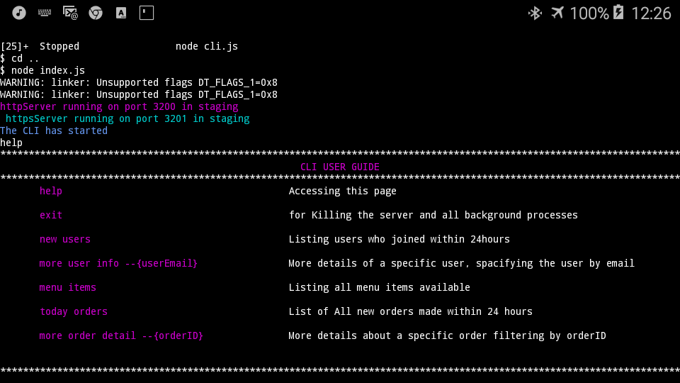

# COMMANDLINE INRERFACE
for the admin to interact with the data at the backstage

### features - command list
***
- `help` - to view the list of commands possible
- `menu items` - to view the list of items available to buy
- `new users`  - to view a list of all users that signed up within the past 24 hours 
- `more user info --{userEmail}` - Lookup the user's details by specifying his or her email
- `today orders` - to view the list of orders made by users within the past 24hours 
- `more order info --{orderid}` - to view order Detail by specifying the orderId
- `exit` - to kill the whole system operation 

## Screenshot
here is the look and feel snapshots

### Help view
